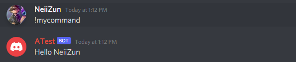
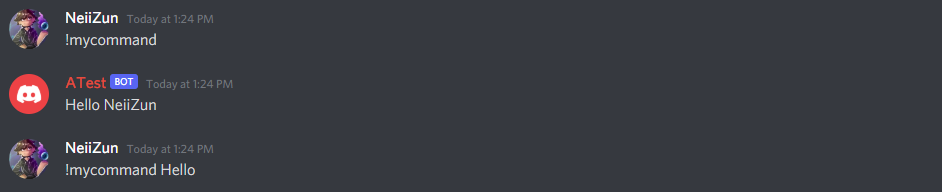

# ? LightDrop

LightDrop is a lightweight library that allows you to create decorator-based commands with <a href="https://github.com/DV8FromTheWorld/JDA">JDA</a>

## Features

<ul>
    <li>Creating commands in a method</li>
    <li>Adding permissions and permission message</li>
    <li>Catch exceptions from commands</li>
    <li>Adding global filters to the command's middleware</li>
</ul>

## Installation

### With maven

```xml
<repositories>
    <repository>
        <id>jitpack.io</id>
        <url>https://jitpack.io</url>
    </repository>
</repositories>
```

```xml
<dependencies>
    <dependency>
        <groupId>me.neiizun</groupId>
        <artifactId>LightDrop</artifactId>
        <version>1.0.0</version>
    </dependency>
</dependencies>
```

### With gradle

```groovy
repositories {
    maven { url 'https://jitpack.io' }
}
```

```groovy
repositories {
    dependencies {
        implementation 'com.github.NeiiZun:LightDrop:1.0.0'
    }
}
```
## Usage

### Hook LightDrop

```java
JDA jda = JDABuilder.createDefault("your token").build();
        
new LightDrop().hook(jda);
```

### Create your first command

```java
public class MyCommand {
    @Command(name = "mycommand")
    public void myCommand(CommandContext context) {
        context.getChannel().sendMessage("Hello " + context.getAuthor().getName()).complete();
    }
}
```

```java 
JDA jda = JDABuilder.createDefault("your token").build();
        
new LightDrop().hook(jda)
    .map(new MyCommand());
```



### Add a permission

```java
public class MyCommand {
    @Command(name = "mycommand", permission="BAN_MEMBERS", permissionMessage="Sorry but you must have `{permission}`")
    public void myCommand(CommandContext context) {
        context.getChannel().sendMessage("Hello " + context.getAuthor().getName()).complete();
    }
}
```

### Set the prefix

```java 
JDA jda = JDABuilder.createDefault("your token").build();
        
new LightDrop().hook(jda)
    .map(new MyCommand())
    .setPrefix("&");
```
(Default prefix is "!")

### Use filters
```java
JDA jda = JDABuilder.createDefault("your token").build();
        
new LightDrop().hook(jda)
    .map(new MyCommand())
    .filter(context -> context.getMessage().getContentRaw().contains("Hello"));
```



Filters are executed before the command, if the filter's condition is true, command won't be executed.

### Exception handling

```java
public class MyCommand {
    @Command(name = "mycommand")
    public void myCommand(CommandContext context) {
        throw new IllegalArgumentException();
    }

    @ExceptionHandler(commands = {"mycommand"}, exception = IllegalArgumentException.class)
    public void except(Exception e, CommandContext context) {
        context.getChannel().sendMessage("An exception has occured").complete();
    }
}

```

You must specify the commands to handle, but if you want handle all commands you can put "*".
Handled exception is not required, default Exception.class.